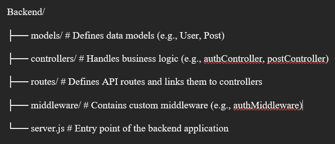
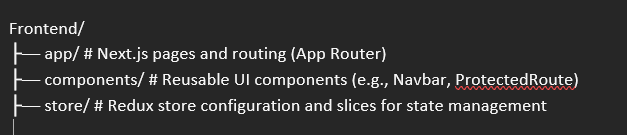

# 📝 BlogSystem - Full-Stack Blog Management System

A modern, feature-rich blog management system with JWT authentication, rich text editing. 
Built with the **MERN stack** and **Redux Toolkit** for state management.

---

## 📋 Table of Contents

- [Features](#-features)
- [Tech Stack](#-tech-stack)
- [Architecture](#-architecture)
- [Setup Instructions](#-setup-instructions)
- [API Documentation](#-api-documentation)
- [Environment Variables](#-environment-variables)
- [Project Structure](#-project-structure)
- [Postman Collection](#-postman-collection)

---

## ✨ Features

### 🔐 Authentication
- User registration and login with JWT tokens  
- Password hashing with bcrypt  
- Protected routes and middleware  
- Persistent sessions with localStorage  

### 📰 Blog Management
- Create, read, update, and delete blog posts  
- Rich text editor (**React Quill**) with formatting options  
- Search functionality across titles and content  
- Author-based post ownership and permissions  

### 🎨 UI/UX
- Modern design with **Tailwind CSS**    
- Loading states and error handling     

---

## 🛠️ Tech Stack

### Frontend
- **Next.js 14** - React framework with App Router  
- **React 18** - UI library  
- **Redux Toolkit** - State management  
- **Tailwind CSS** - Utility-first CSS framework  
- **React Quill** - Rich text editor   
### Backend
- **Node.js** - JavaScript runtime  
- **Express.js** - Web framework   
- **Mongoose** - MongoDB ODM  
- **JWT** - JSON Web Tokens for authentication  
- **bcryptjs** - Password hashing   

---

## 🏗️ Architecture

### 🧩 MVC Pattern (Backend)



### ⚛️ Component-Based Architecture (Frontend)


---

## 🔄 Data Flow

1. **Client Request** → User interacts with React components  
2. **Redux Action** → Dispatches async thunk (API call)  
3. **API Endpoint** → Express routes receive request  
4. **Middleware** → Authentication check (for protected routes)  
5. **Controller** → Business logic execution  
6. **Model** → Database operations via Mongoose  
7. **Response** → JSON data sent back to client  
8. **Redux State Update** → UI re-renders with new data  

---

## 🔑 Authentication Flow

`Register/Login → JWT Token Generated → Token Stored in localStorage → Token Sent in Authorization Header → Middleware Validates Token → User Info Attached to Request → Controller Accesses User Info`

---

## 🚀 Setup Instructions

### 🧰 Prerequisites
- Node.js (v16 or higher)  
- MongoDB (local or MongoDB Atlas)  
- npm  

---

### ⚙️ Backend Setup

1. Navigate to backend directory  
   ```bash
   cd backend
2. Install dependencies
   ```bash
   npm install
3. Create .env file
   ```bash 
   PORT=5000
   MONGODB_URI=mongodb://localhost:27017/blog-system
   JWT_SECRET=your_super_secret_jwt_key_change_this_in_production 
4. Start the server
   ```bash
   # Development mode with nodemon
   nodemon index.js

   # Production mode
   npm start
Server will run on http://localhost:5000

### Frontend Setup

1. Navigate to frontend directory
   ```bash
   cd frontend
2. Install dependencies
   ```bash
   npm install
3. Create .env.local file
   ```bash
   NEXT_PUBLIC_API_URL=http://localhost:5000/api
4. Start the development server
   ```bash
   npm run dev   
Frontend will run on http://localhost:3000

---
### 📡 API Documentation
- Base URL 
   ```bash 
   http://localhost:5000/api
  Authentication Endpoints
1. Register User
-  POST /auth/register
-  Request Body:
   ```bash
   {
   "name": "John Doe",
   "email": "john@example.com",
   "password": "password123"
   }

- Response (201)
   ```bash   
   {
   "message": "User registered successfully",
   "token": "eyJhbGciOiJIUzI1NiIsInR5cCI6IkpXVCJ9...",
   "user": {
   "id": "507f1f77bcf86cd799439011",
   "name": "John Doe",
   "email": "john@example.com"
    } 
  }
2. Login User
-  POST /auth/login
-  Request Body:
   ```bash
   json{
   "email": "john@example.com",
   "password": "password123"
   }

- Response (200)
  ```bash
   {
  "message": "Login successful",
  "token": "eyJhbGciOiJIUzI1NiIsInR5cCI6IkpXVCJ9...",
  "user": {
    "id": "507f1f77bcf86cd799439011",
    "name": "John Doe",
    "email": "john@example.com"
    }
  }

3. Get Current User
-  GET /auth/me
-  Headers:
   ```bash
   Authorization: Bearer <token>
-  Response (200):
   ```bash
   "user": {
    "id": "507f1f77bcf86cd799439011",
    "name": "John Doe",
    "email": "john@example.com"
   }
### Blog Post Endpoints
4. Get Posts (Public)
-  GET /posts
-  Query Parameters:
   ```bash
   search (optional) - Search in title and content
   author (optional) - Filter by author ID
-  Example:
   ```bash
   GET/posts?search=javascriptauthor=507f1f77bcf86cd799439011
-  Response (200)
   ```bash 
   "post": {
    "_id": "507f191e810c19729de860ea",
    "title": "Getting Started with JavaScript",
    "content": "<p>JavaScript is a versatile programming language...</p>",
    "excerpt": "JavaScript is a versatile programming language...",
    "author": {
      "_id": "507f1f77bcf86cd799439011",
      "name": "John Doe",
      "email": "john@example.com"
    },
    "status": "published",
    "createdAt": "2025-01-15T10:30:00.000Z",
    "updatedAt": "2025-01-15T10:30:00.000Z"
  }
6. Create Post (Protected)
-  POST /posts
-  Headers:
   ```bash
   Authorization: Bearer <token>
   Content-Type: multipart/form-data
- Form Data:
  ```bash
  title: "My New Blog Post"
  content: "<p>This is the content of my blog post...</p>"
  excerpt: "This is a short excerpt" (optional)
  status: "published" (optional, default: "published")
7. Update Post (Protected- owner only)
-  PUT /posts/:id
-  Headers:
   ```bash
   Authorization: Bearer <token>
   Content-Type: multipart/form-data
- Form Data:
  ```bash
  title: "Updated Blog Post Title" (optional)
  content: "<p>Updated content...</p>" (optional)
  excerpt: "Updated excerpt" (optional)
8. Delete Post (Protected- owner only)
-  Delete /posts/:id
-  Headers:
   ```bash
   Authorization: Bearer <token>
---

## ⚙️ Postman Collection

You can import the following requests into Postman to test the **API endpoints** directly.

### Collection Variables

Set the following variables in your Postman Collection:

| Variable | Value | Description |
| :--- | :--- | :--- |
| `baseUrl` | `http://localhost:5000/api` | The base URL for the API |
| `token` | (Empty) | Will be set dynamically after successful login |

### API Endpoints (cURL Commands)

 1. Register User
    ```bash
    curl -X POST "{{baseUrl}}/auth/register" \
    -H "Content-Type: application/json" \
    -d '{
    "name": "John Doe",
    "email": "john@example.com",
    "password": "password123"
    }'
 2. Login User  
    ```bash
    curl -X POST "{{baseUrl}}/auth/login" \
    -H "Content-Type: application/json" \
    -d '{
    "email": "john@example.com",
    "password": "password123"
    }'
 3. Get Current User (Protected Route)
    ```bash
    curl -X GET "{{baseUrl}}/auth/me" \
    -H "Authorization: Bearer {{token}}"
 4. Get All Posts
    ```bash
    curl -X GET "{{baseUrl}}/posts"
 5. Search Posts
     ```bash
     curl -X GET "{{baseUrl}}/posts?search=javascript"
 6. Get Single Post
    ```bash
    curl -X GET "{{baseUrl}}/posts/POST_ID_HERE"
    # Replace POST_ID_HERE with an actual Post ID
 7. Create Post (Protected Route, Multipart Form)
    ```bash
    curl -X POST "{{baseUrl}}/posts" \
    -H "Authorization: Bearer {{token}}" \
    -F "title=My New Blog Post" \
    -F "content=<p>This is the content of my blog post</p>" \
 8. Update Post (Protected Route)
    ```bash
    curl -X PUT "{{baseUrl}}/posts/POST_ID_HERE" \
    -H "Authorization: Bearer {{token}}" \
    -F "title=Updated Title" \
    -F "content=<p>Updated content</p>"
    # Replace POST_ID_HERE with the Post ID to update


 9. Delete Post
    ```bash
    curl -X DELETE "{{baseUrl}}/posts/POST_ID_HERE" \
    -H "Authorization: Bearer {{token}}"
    # Replace POST_ID_HERE with the Post ID to delete
---

## 🧪 Testing the Application (Frontend Workflow)

Use the frontend application running on `http://localhost:3000` for a complete end-to-end test.

### 1. Test Registration
1.  Open `http://localhost:3000/register`.
2.  Fill in the form and **Register**.
3.  You should be redirected to the home page upon successful registration and logged in.

### 2. Test Login
1.  **Logout** if currently logged in.
2.  Go to `http://localhost:3000/login`.
3.  **Login** with your registered credentials.

### 3. Test Create Post
1.  Click the **"Create Post"** button.
2.  Add a **title** and **content**. 
3.  **Submit** the form.
4.  Verify the new post appears on the home page.

### 4. Test Search
1.  Use the **search bar** on the home page.
2.  Search for **keywords** present in your posts.

### 5. Test Edit Post
1.  Click on a post you created to view it.
2.  Click the **"Edit"** button (or equivalent).
3.  Modify the title and content and **Save** the changes.

### 6. Test Delete Post
1.  Open a post you created.
2.  Click the **"Delete"** button.
3.  **Confirm** the deletion.

---